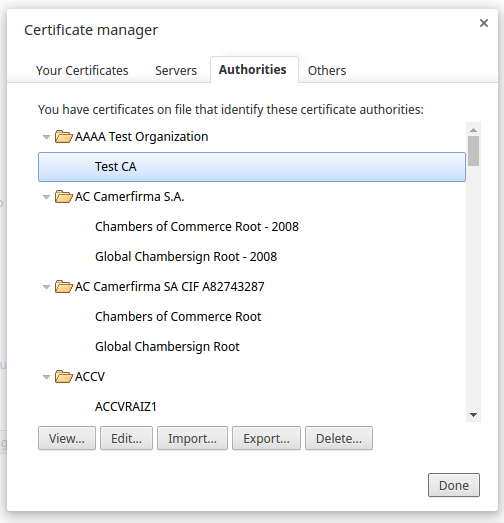

#Introduction

The Flight Delay application generates an insurance quote for a traveler who may be subjected to delay in the Flight. The traveler specifies his/her travel plan namely traveling city pair, number of travelers etc. The application then generates the quote based on the pre-defined business logic.


The application uses Weather data from 'OpenWeatherAPI' for finding the weather condition at the destination city. The quote will be calculated based on the business logic which takes into consideration the weather conditions and number of persons traveling. So if the weather is forecast to be rainy the business logic factors this, and the insurance quote would be a higher. If the insurance is for more than one traveler, then the insurance quote will include a discount.

Once the quote is generated, the traveler can also purchase this insurance through the application (this part will be included later).

The user will get a quote for travel insurance, by filling up a form on home page. The user can select the source and the corresponding destination from the dropdown menu and can select a date with in next 5 days. All the form details are sent to the quote API for getting corresponding weather conditions, and the quote generated is sent back to the user. The user can now apply for insurance if needed. Before applying for the insurance he needs to be registered. Registered user must be logged in to apply for the insurance. After applying for the insurance it can be viewed under the insurance tab of the user.


## Code Structure
The *server.js* file start the server and listen for requests. All the call to the server is handled by the *router.js* file in *app/routes/'*.
*router.js* calls the corresponding controllers for the request.

1. On user registration it will call the signup module in *register.js* ('app/controllers/').
The signup module handles the registration of the user.
The database schema is mentioned in the *login.js* ('app/models/').
2. On user login it will call the signin module in *login.js* ('app/controllers/').
The signin module does the authentication check for the user.
The database schema is mentioned in the *login.js* ('app/models/').
3. For quote generation it will transfer the call to *quote.js* ('app/controllers/').
The quote controller fetches the data from the weather API and generates the quote.
The database schema is mentioned in the *weather.js* ('app/models/').
4. To check for the previous insurances, call getInsurance module in *insurance.js* ('app/controllers/').
The getInsurance fetches the details from the database and return it.
The database schema is mentioned in the *insurance.js* ('app/models/').
5. When apply for an insurance, call createInsurance module in *insurance.js* ('app/controllers/').
The createInsurance stores the details in the database.
The database schema is mentioned in the *insurance.js* ('app/models/').

## File Structure


## Quick Start

### Install dependencies:
```
$ npm install
$ bower install
```
### Start the server:
```
$ npm start
```
### Setup an https secure connection
 1. Import *ca.crt*  file from 'ssl/' folder into your browser's certificate manager.
 

### Browser Url
```
https://localhost:9030
```
